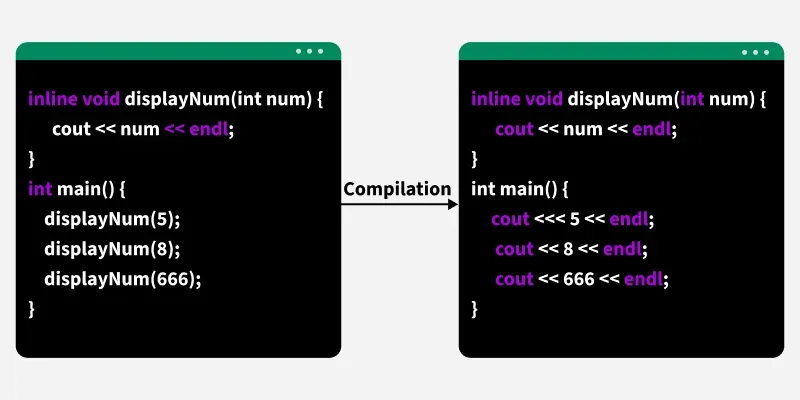

--- 
title: Class
---

# Class

In C++, __member functions__ are the functions that are declared as a member of a class. There are many different distinctions of member functions: `static` vs `non-static`, `const` vs `non-const`, etc. 

## Const vs Non-const Member Functions

Constant member functions are functions that promise not to change the values of the data members in the class. To make a member function constant, `const` keyword is added after the function prototype. 

Constant member functions can be called by both `non-const` and `const` objects. For example, in the code below, calling `nonConstWidget.supply()` and `constWidget.supply()` will both return `0`. 

```c++
#include<iostream>

class Widget {
public:
	int supply() const {
		return 0;
	}
};

int main() {
	Widget nonConstWidget;
	std::cout << nonConstWidget.supply() << std::endl; // 0
	const Widget constWidget;
	std::cout << constWidget.supply() << std::endl; // 0
}
```

On the other hand, non-const member functions __can__ only be called by non-const object. Constant object __cannot__ call non-const member functions. 

```c++
#include<iostream>

class Widget {
public:
	int supply() {
		return 0;
	}
};

int main() {
	Widget nonConstWidget;
	std::cout << nonConstWidget.supply() << std::endl; // 0
	const Widget constWidget;
	std::cout << constWidget.supply() << std::endl; // error
}
```
For example, the code below will produce the following error:

```
[Error] passing 'const Widget' as 'this' argument discards qualifiers [-fpermissive]
```

This is indeed intuitive because you cannot change value of constant object once it is initialized. Calling non-const function may result in changes of value, so it is not allowed. 

### Interview Implication 1

__Question__: What is the difference between constant and non constant member functions?

__Sample Answer__: Constant member functions are the functions declared inside a class that promise not to change the value of the class members. Non-constant is just the opposite, changing class members' value is allowed. 

## Static Member Functions

Static member functions are functions that belong directly to the class, not to any object of the class. As a consequence, static member functions are independent to any object instance.

Because it is independent from any object instance, it __can be called without creating an object__.

```c++
#include<iostream>

class Widget {
public:
	static void print() {
		std::cout << "print is called" << std::endl;
	}
};

int main() {
	Widget::print();
}
```

For example, the code above will result in `print is called` being output. 

Other consequence of this independency is that static member functions __can only access static data members or other static member functions__. This is indeed intuitive because static data members of a class are required to be independent to any class object. So, accessing static data members do not require instantiating the class, i.e., creating class instance. 

## Inline (Member) Functions

Member functions are inlined by default. If request is granted, inline function simply means that the compiler will expand the code during compilation. This is aimed to reduce __function-call overhead__. 



It is important to note that inlining a function is only a __request__ to the compiler; the __compiler may ignore__ inlining the function if the function is too complex, for example, containing loops or recursive. 

### Multiple Definition of Inline Functions

Interestingly, there can be more than one definition of inline function, as suggested by number 13.3 in the following [link](https://timsong-cpp.github.io/cppwp/n4861/basic.def.odr#13). 

Therefore, the following example is valid and it will print `2` when `gcc test3.cpp test4.cpp -o test` is ran. 

```c++
// test3.cpp
#include<stdio.h>

inline int add(int x, int y) {
    return x + y;
}

int main() {
    printf("%d", add(1,1));
}
```

```c++
// test4.cpp
#include<stdio.h>

inline int add(int x, int y) {
    return x + y;
}
```

However, as given in number 13.8, each such definition shall consist of the same sequence of tokens! If the two definitions of the inline functions are not the same (possibly doing two different things), as a consequence, the program is __ill-formed no diagnostic__ (IFNDR), i.e., the program will run in an undefined behaviour, but the compiler will not report anything to you. For further reference, you can refer to this [link](https://stackoverflow.com/questions/64537486/inline-functions-with-same-type-but-different-body-in-cpp-files). 

### Multiple Definition of Non-inline Functions

On the other hand, when function is not inlined as written below, it will cause multiple-definition errors. 

```c++
// test3.cpp
#include<stdio.h>

int add(int x, int y) {
    return x + y;
}

int main() {
    printf("%d", add(1,1));
}
```

```c++
// test4.cpp
#include<stdio.h>

int add(int x, int y) {
    return x + y;
}
```

As mentioned, when `gcc test3.cpp test4.cpp -o test` is ran, the following error will be produced. 

```
/usr/bin/ld: /tmp/cchVHrlD.o: in function `add(int, int)':
test4.cpp:(.text+0x0): multiple definition of `add(int, int)'; /tmp/ccmUMdb2.o:test3.cpp:(.text+0x0): first defined here
collect2: error: ld returned 1 exit status
```

## Abstract vs Concrete Classes

### What is Abstract Class?

Abstract classes are classes that acts as a __contract__ for other classes. Because it is a contract, abstract classes will contain a __set of required behaviours__ (at least one requirement) as a foundation for the other classes to obey. 

In C++, these required behaviours are implemented as `pure virtual functions`. Therefore, technically speaking, abstract classes are the classes that have at least 1 pure virtual member function. 

The following syntax is how we will define member functions as pure virtual:

```c++
class Widget {
public:
	virtual void do_things() = 0;
}
```

By defining a member function to be pure virtual, we will not provide the implementation of the class; however, we require classes that are derived from the class, in this case: `Widget`, to define the function.

### What is Concrete Class?

On the contrary, when a class does not have any pure virtual function, we can say that the implementation of the class, i.e., the representation is complete or fully defined. In this case, we will call the class as concrete classes. 

### Instantiation

Another important distinction between these two types of classes is related to __instantiation__. In concrete class, since the implementation is completely known and all class behaviours are well-defined, objects of concrete classes can be instantiated. 

On the other hand, because pure virtual functions in abstract class does not have implementation. This makes the behaviour of the class incomplete, so consequently we cannot instantiate it. The only way to define an abstract class is by using pointer or reference; this is valid because pointer and reference do not create objects, it is just an address. However, when defining abstract class through reference, it requires the object to be initialized. For example,

```c++
class Widget {
public:
	virtual void do_things() = 0;
};

int main() {
	Widget obj; // ERROR! abstract class can't be instantiated
	Widget* obj1; // OK!
	Widget& obj2; // ERROR! Reference must be initialized
}
```

## Inheritance

Recall that by defining a member function to be pure virtual, we require classes that are derived from the class to define the function. Then, the question is how to define a class that derives another class. This is where inheritance comes into play. 

### Syntax

To define that a class is derived from another class, the syntax follows this format: `class derived_class_name : mode parent_class_name {}`. There can be three types of inheritance modes: `public`, `protected`, and `private`. An example for this is as follows.

```c++
class Base {};
class Derived : public Base {};
```

### Inheritance Modes: `public` vs `private` vs `protected`

In inheritance, all non-private (public and protected) members of the base class will be inherited by the derived class. However, the mode of the inherited class members will be different according the chosen type of inheritance modes. The following shows how it is differed from each other:

1. When the inheritance mode is `public`, all `public` parent class members (class members include member functions and variables) will be inherited as `public` and all `protected` parent class members will be inherited as `protected`. 
2. When the inheritance mode is `protected`, all `public` and `protected` parent class members will be inherited as `protected`. 
3. When the inheritance mode is `private`, all `public` and `protected` parent will be inherited as `private`. 

### `override`

After properly defining the inheritance relationship, we can then define the pure virtual functions by overriding it. A good practice when overriding function is to verbosely write the `override` keyword. This is beneficial because it allows the compiler to catch declaration mistake. 

### Example

Now, using inheritance, we can define the derived class and assign it to the reference of the base class. The code is as follows:

```c++
class Base {
public:
    virtual void do_things() = 0;
};

class Derived : public Base {
public:
    void do_things() override {}
};

int main() {
	Base obj; // ERROR! abstract class cannot be instantiated
	Derived obj1; // OK! Concrete class can be instantiated
	Base* obj2; // OK!
	Base& obj3 = obj1; // OK! Reference must be initialized!
}
```

## Virtual (Member) Functions

An intuitive follow-up question is that how if we remove `= 0` from pure virtual functions. Indeed, the functions will then become virtual functions. Not like pure virtual functions, having virtual functions will __not make a class abstract__; however, having at least 1 virtual function will make it a polymorphic class. Not like pure virtual functions, virtual functions __can be implemented__. 

### Static vs Dynamic Binding

A question is that if virtual functions can have implementation, then what is the difference between virtual functions and non-virtual functions? 

The difference is as follows. Virtual functions is used to support __dynamic binding__ or __runtime polymorphism__, whereas non-virtual functions will use __static binding__. 

In static binding, the compiler will link the function call and the function definition during the compilation time (only for non-virtual functions). Because compiler does not know the runtime type of the object, the compiler will use the type that we explicitly give, the compile-time type, to choose the appropriate function. To make sense of this, observe the following example. 

```c++
Base* obj = new Derived1();
obj = new Derived2();
```

In this example, during runtime, `obj` can have the type of `Derived1`, which then changed to `Derived2`. The compiler have no idea what happen during the runtime. The only thing it knows is that `obj` is given the type of `Base`, the one that we explicitly give. Therefore, it will link non-virtual functions according to `Base` type. 

In fact, this is how function is chosen among __overloaded functions__, i.e., function overloading. Function overloading uses static binding. 

On the other hand, dynamic binding happens during runtime. This is why it is called _runtime_ polymorphism because it happens in the runtime. Different than static binding, the function that is chosen is based on the runtime type of the object, not the compile-time type. This is achieved with the help of `vTable` and `vPtr` that will be explained afterwards. 

Observe the following example to understand the difference between static and dynamic binding. 

```c++
class Base {
public:
	virtual void display() {
		cout << "Display in Base" << endl;
	}
};

class Derived : public Base {
public:
	void display() override {
		cout << "Display in Derived" << endl;
	}
};

void do_things(Base& obj) {
	cout << "Do things Base" << endl;
	obj.display();
}

void do_things(Derived& obj) {
	cout << "Do things Derived" << endl;
	obj.display();
}

int main() {
	Derived derived;
	Base& base = derived;
	do_things(base);
}
```

The following code will output:
```
Do things Base
Display in Derived
```

Observe that `base` has a runtime type of `Derived` and a compile-time type of `Base`. Choosing between overloaded functions will use static binding, i.e., the compile type. This is why `Do things base` is printed. However, `obj.display()` will output `Display in Derived` because the runtime type is `Derived`; it will choose the `display` function from the runtime type, which is `Derived`. 

### `vTable` and `vPtr`

To support dynamic binding, as mentioned in the previous chapter, the compiler will implement `vTable` and `vPtr` underneath the hood. `vTable` and `vPtr` will only be implemented for polymorphic class (class that has at least one virtual function); in other words, class with no virtual function will not have `vTable` and `vPtr`. 

The `vTable`, virtual function table, is essentially a table of pointers to function. Each virtual function in the class will be given an entry in the `vTable`. Each entry is a pointer to the __most derived function__ that the class should call; if the class has no child, the entry will point to its own implementation. It is also important that `vTable` is generated during __compile time__ for each polymorphic class in the program. 

Now, with each polymorphic class has its own `vTable`, during object construction, the compiler will then implement a pointer to point to the `vTable` of the class it is assigned to. This pointer is called `vPtr`, and the initialization of `vPtr` happen during __runtime__. For example,

```c++
Base* obj = new Derived1();
obj = new Derived2();
```

First, when `obj` is being assigned to object of type `Derived1`. `vPtr` of object `obj` will be set to `Derived1`'s `vTable`. Afterwards, when `obj` is being assigned to object of type `Derived2`, `vPtr` of object `obj` will be set to `Derived2`'s `vTable`. 

### Object Slicing

It is also crucial to note that even though polymorphic class can be instantiated, dynamic binding can only be activated when pointer or reference is used. This is because: when being instantiated without using pointer or reference, the type is known for certain _thus_ static binding will be used. 

However, if you still insist assigning derived class object to the base object, object slicing will happen. This means that the derived class additional attributes will be cut off to generate the base class object. 

Why object slicing happen? This happen because when object is instantiated, for example: `Base base`, it has a static type of `Base`. When you assign it to `derived`, an object of type `Derived`, the compiler will perform implicit type conversion such that the type will change to `Base`. It does not make sense to have an object of `Base`, but the content is `Derived`; this is the same as having `int` but the content is `double`. That is why it slices the additional attributes and uses static binding to call the perform the function call. 

Why object slicing does not happen when pointer or reference is used? This is because pointer or reference is an address. `Base*` and `Derived*` both are addresses; the difference is just how we view the content of the addresses as. `Base*` means we view the content as object `Base`, while `Derived*` means we view the content as object `Derived`. When we assign `Derived*` to `Base*`, it is just changed the way we view the object as, which is further supported by `vPtr` and `vTable`. 